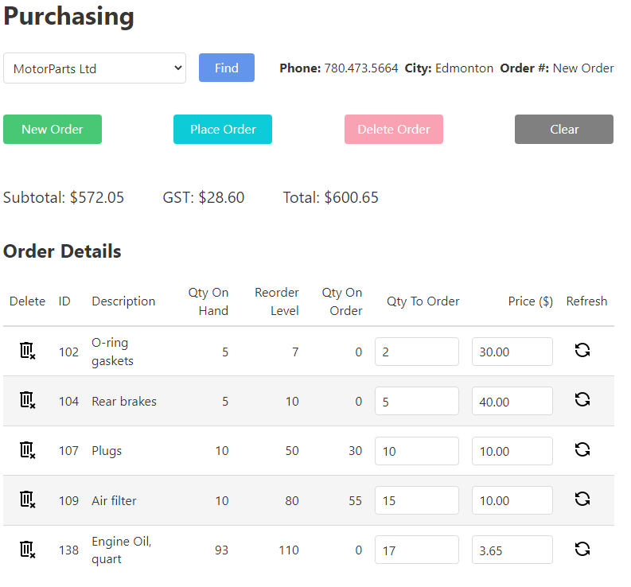
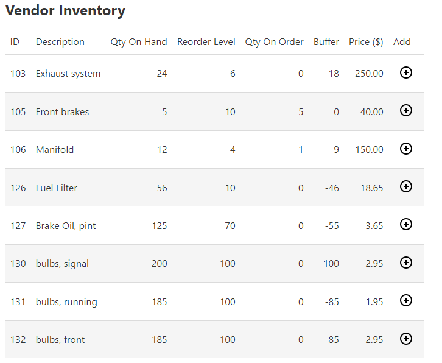

# Bike R Us Web Form Application

## Overview

This repository is for code view only.   

Working as a group, two other awesome developers and I delivered this application for a programming course at NAIT as the final project. It is not the original project repository. For an academic project, I cannot offer any additional details about the database as well as the app login credentials.   

> This is a team project based on the [**eBikes database**]

**Team Project Size: 3 members.** The team project consists of a set of **baseline requirements** and three **core scenarios** (subsystems). Each team member is responsible to complete the subsystem for their selected scenario; the baseline requirements are to be shared equitably by all members of the team. 

**Bikes R Us® Inc.** would like to convert their manual Management System into a set of computerized subsystems that will allow employees to manage various aspects of the business via an Intranet application. **Bike R Us** has a brick-and-mortar presence that needs to be supported by this application. As such, the application will allow the company to perform the following key business tasks: Purchasing, Receiving, Sales/Return.

Here, I will only shows the requirement and design document on my part, Purchasing.
- [**Purchase**](./docs/ReadMe.md) - Requirement and design details.

&nbsp;
### Page Screenshots
Purchase Order Details Table

&nbsp;

Vendor Inventory Table

Two tables can work interactively to add/remove item records. 

&nbsp;
## Team Placeholder

> An awesome developer - Receiving 
 
> An amazing developer - Sales/Return

> Jianhe Wang - Purchasing

&nbsp;
# Lincese 
For educational purpose only. 

